# Gamedream - A portfolio project.

Welcome to my code institute website readme. This is for my milestone 3 project. For this, I have decided to create a game wishlisting service to allow for storing games and then wishlisting them; complete with their prices, name and description. I have done this because the goal for this project was to create a python website which was able to utilize either a relational database or a non-relational database in order to provide CRUD functionality to a user through relating at least 2 tables in said database.

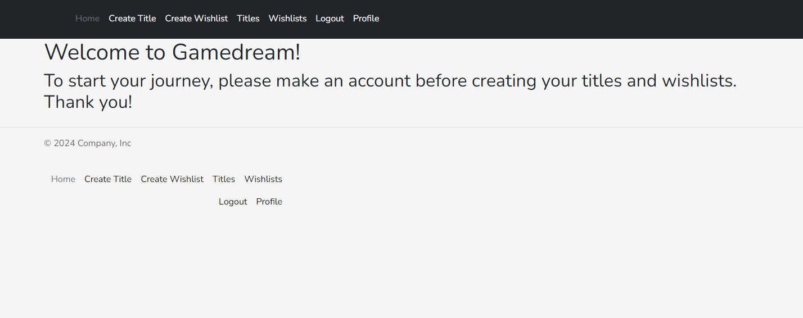

## Table of Contents

1. [Planning & Development](#planning--development)
2. [Features](#features)
3. [Testing](#testing)
4. [Deployment](#deployment)
5. [Languages](#languages)
6. [Media Queries](#media-queries)
7. [Software](#software)
8. [Code](#code)
9. [Credits](#credits)

# Planning & Development #

### Business Strategy

When I was considering what kind of website I was going to build, I had recieved many ideas from my weekly tutor, like quizzes and reviews. However I decided upon creating a wishlist service for two reasons. The first was because of my own personal interest in video games and the fun of being able to work with something I enjoy in an educational setting. The second reason was because I thought it would interesting to explore more of flask and what it has to offer outside of the code institute walkthroughs, as I had come to find the most fufilment working with flask as opposed to everything else on the course thus far.

### Target Audience

When I conducted my marketing research for this project I was astounded to learn that there was zero search results for wishlists. Not a single one. I was suprised because this was a very common feature on many websites and I was also expecting similar results like santa's wishlist etc. The fact that there was no results in this category lets me know that wishlisting is a service that is expected to be a part of a larger website rather than it's own dedicated service both due to convinience and the potential to link directly to the wanted items on the site for quick access and real time updates e.g. sales. This can be seen in other gaming services with wishlisting features like Steam and GOG

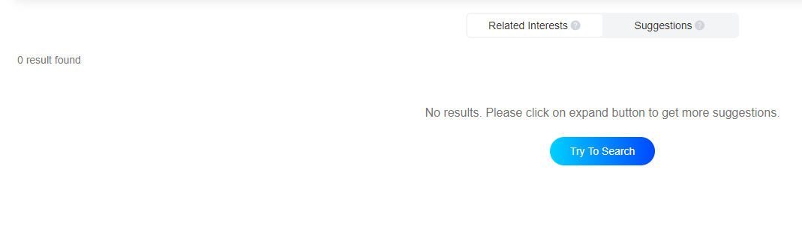

### User Needs

#### User Stories

1. Be able to securely create an account, log in and log out.
2. Create a game title with all the details they would want.
2. Create a game wishlist with all the details they would want.

### Site Objectives

* Create a UI that is easy to read with non-conflicting colors.
* Ensure that the site complies to responsive design theory.
* Allow users to create titles with full CRUD functionality.
* Allow users to create wishlists with full CRUD functionality.
* Ensure that users can log in securely.
* Prevent other users from altering or deleteing titles and wishlists they have not created.
* Make sure that the site is accessible to screenreaders
* Create a good design flow so that users are lead from page to page easily.

### Research

{}

### Wireframe

These are the wireframes I created to help me plan out the design of my website. The designs were not final but there were a massive help in creating the project.

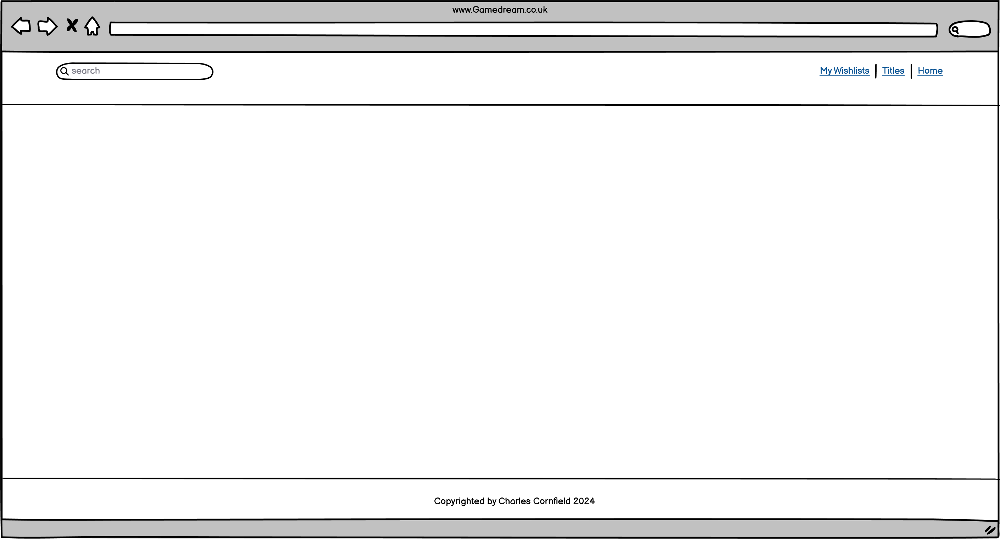

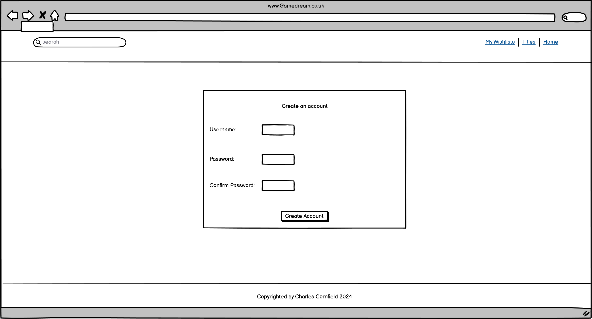

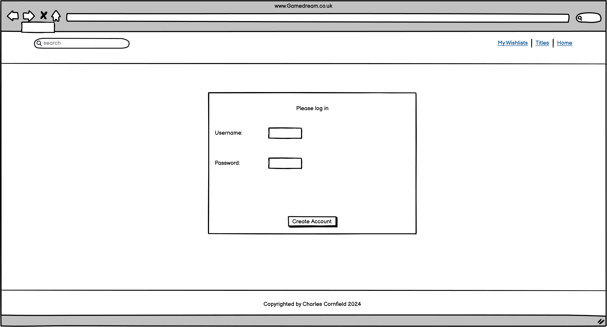

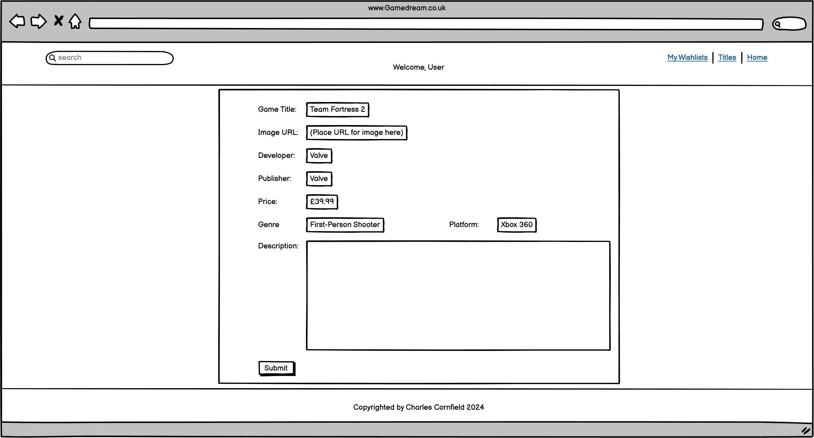

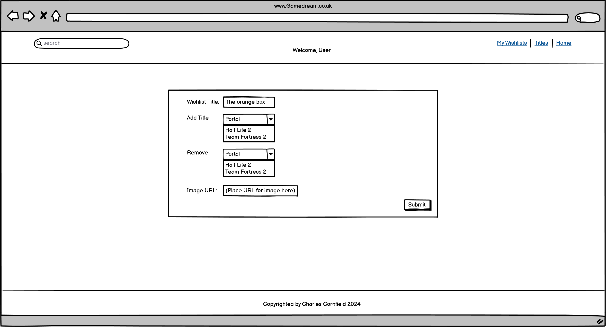

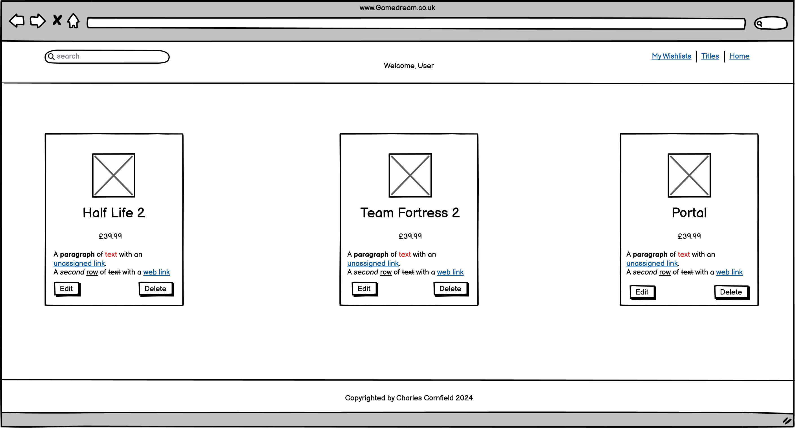

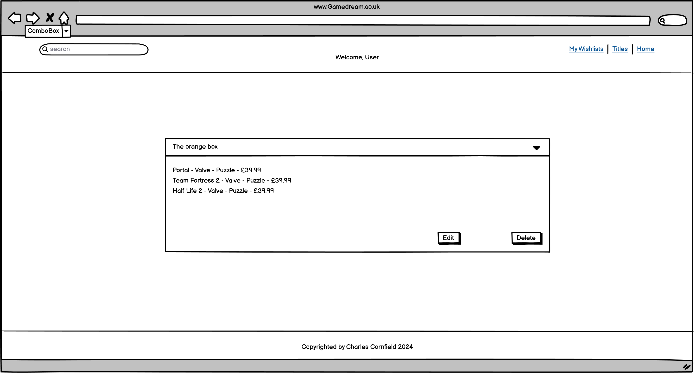

### Color Scheme

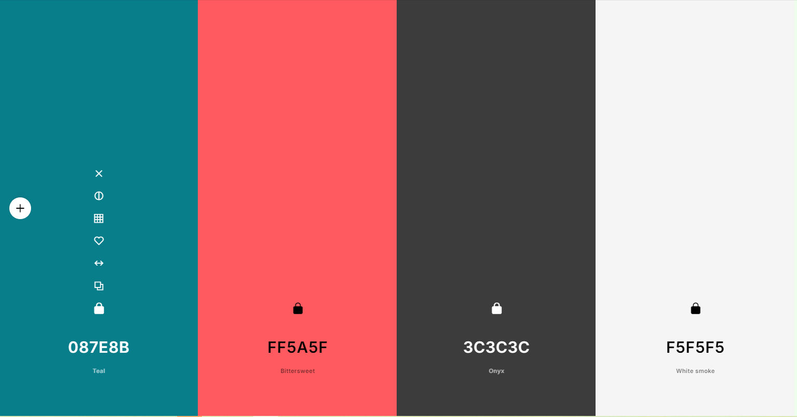

{}

### Typography

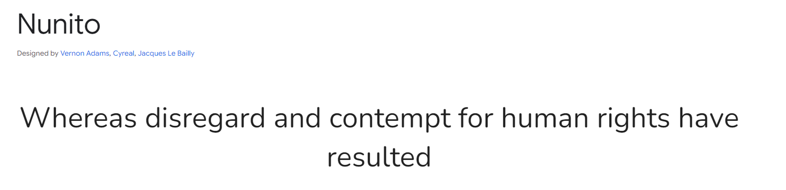

{}

# Features #

### General

# Testing #

{}

## Validator Testing

### W3C Validator

{}

# Deployment #

To deploy my site I used heroku. This was done by using the following steps.

1. Generating a requirements.txt file containing the python dependencies needed for the project.
2. Create a Procfile to contain the command for starting up the website.
3. Create a new variable in __init__.py called DATABASE_URL to allow the project to read an external database.
4. Log on to Heroku.com and create a new app, while also giving it a unique name and setting the region to europe.
5. In the settings section, create a config var on the heroku app and assign it the url given by Code Institute.
6. Add to the config var all the details contained in env.py except DEVELOPMENT and DB_URL.
7. Go onto the deploy section, and use Connect to Github as the deployment method.
8. Select your github repo from the list and use Manual Deploy to deploy the branch of choice.
9. Use the run command feature and type python3 into the console to get the python interpreter.
10. Run Terminal.py to build the database for the site.
11. Click run app and enjoy! Be sure to ensure that the site works as it should and that DEBUG is set to false.

# Languages #

* For the development of this website I utilized HTML, CSS, JS and Python in order to create it. 

* Bootstrap 5.3.3 was used to create the accordion and for it's grid system in laying out site features.

# Media Queries #

Media Queries were used exclusively in the role of increasing the responsiveness of web pages by...

# Software #

VS Code was used to create the website. It was the tool for typing out HTML, CSS, JS and Python code along with pushing site updates to the Github repository. Gitpod was used to provide backend and virtual environment support for the use of python without which the site would not function.

Balsamiq was used to create the wireframes saw earlier in this readme.

The microsoft snipping tool was used to take the relevant screenshots.

# Code #

* https://stackoverflow.com/questions/44051379/css-how-to-pin-footer-to-bottom-of-the-page
* https://getbootstrap.com/docs/5.3/examples/footers/
* https://getbootstrap.com/docs/5.3/examples/headers

# Credits #

Code Institute for the opportunity to learn and hone the craft of developing websites.

My loving and supportive family for supporting me in this endeavor.