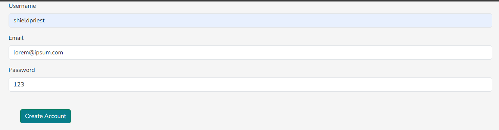
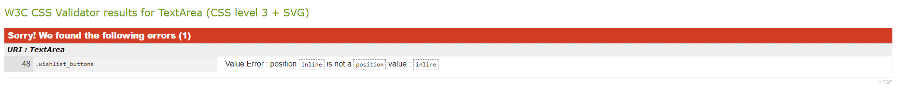

# Gamedream - A portfolio project.

Welcome to my code institute website readme. This is for my milestone 3 project. For this, I have decided to create a game wishlisting service to allow for storing games and then wishlisting them; complete with their prices, name and description. I have done this because the goal for this project was to create a python website which was able to utilize either a relational database or a non-relational database in order to provide CRUD functionality to a user through relating at least 2 tables in said database.

[Click here to access the live website](https://gamedream-f8bd26b6b425.herokuapp.com/)

## Table of Contents

1. [Planning & Development](#planning--development)
2. [Features](#features)
3. [Testing](#testing)
4. [Deployment](#deployment)
5. [Languages](#languages)
6. [Media Queries](#media-queries)
7. [Software](#software)
8. [Code](#code)
9. [Credits](#credits)

# Planning & Development #

### Business Strategy

When I was considering what kind of website I was going to build, I had recieved many ideas from my weekly tutor, like quizzes and reviews. However I decided upon creating a wishlist service for two reasons. The first was because of my own personal interest in video games and the fun of being able to work with something I enjoy in an educational setting. The second reason was because I thought it would interesting to explore more of flask and what it has to offer outside of the code institute walkthroughs, as I had come to find the most fufilment working with flask as opposed to everything else on the course thus far.

### Target Audience

When I conducted my marketing research for this project I was astounded to learn that there was zero search results for wishlists. Not a single one. I was suprised because this was a very common feature on many websites and I was also expecting similar results like santa's wishlist etc. The fact that there was no results in this category lets me know that wishlisting is a service that is expected to be a part of a larger website rather than it's own dedicated service both due to convinience and the potential to link directly to the wanted items on the site for quick access and real time updates e.g. sales. This can be seen in other gaming services with wishlisting features like Steam and GOG

### User Needs

#### User Stories

1. Be able to securely create an account, log in and log out.
2. Create a game title with all the details they would want.
2. Create a game wishlist with all the details they would want.

### Site Objectives

* Create a UI that is easy to read with non-conflicting colors.
* Ensure that the site complies to responsive design theory.
* Allow users to create titles with full CRUD functionality.
* Allow users to create wishlists with full CRUD functionality.
* Ensure that users can log in securely.
* Prevent other users from altering or deleteing titles and wishlists they have not created.
* Make sure that the site is accessible to screenreaders
* Create a good design flow so that users are lead from page to page easily.

### Wireframe

These are the wireframes I created to help me plan out the design of my website. The designs were not final but there were a massive help in creating the project.

### Color Scheme

I chose the above color scheme because I was already quite fond of how the site was looking with the default colors. I opted to change the colors for ones that were still the same colors, just in different more muted hues so that they would pop naturally out from the background.

### Typography

When I was deciding on a font to use I was not really concern with finding something bombastic or overly stylized. Like the color scheme I wanted something that was still similar to the standard but was still distinct enough to be eyecatching. I decided on Nunito because I thought it had a pleasing design and would also still be clear enough to be readable on smaller devices.

### Database

The above database model shows the relationships between all of the models in my database and their relationships. It features a many to many database with the wishlist titles model to allow for multiple titles to be assigned to one wishlist while allowing those titles to appear on multiple wishlists. It also features a user class which interacts with author ID tables to make it so that only specific signed in users can edit or delete the wishlists/titles that they have created. It is assigned at creation by assigning the author ID to the current ID of the signed in user.

# Features #

### General

Alot of the features on my website revolve around ensures that the user is able to have CRUD functionality. The ability to Create, Read, Update and Delete any and all records they create for the database. This is to ensure users have complete control over what they can input into the site and also to comply with good database practises. For this I will be going page by page since there is alot going on for each feature and I wish to be as comprehensive as I can.

### Home page

The above image is the first thing that a user will see when accessing my site. A line of text will welcome the user to the site and inform them that they need to create an account and log onto the site before any titles and wishlists can be created. At the top of the screen you can see the header and along the bottom you can see the footer. These both react to whether the user is logged in or not and as such will display certain features depending on this. They are responsive as the screen width changes and the header is a bright white to stand out from the black background. The footer text is black for similar reasons.

### Account Creation

The information in the above image is example text. Upon creating an account, the password will be hashed in order to ensure complete security. The login details here get assigned to a database called User which saves it to be used with flask-login.

### Log in Screen

The user uses this screen to log onto the site. Using flask-login, the provided details are compared to what is currently stored in the user data table and if there is a match the user is then logged on and given the variable of current_user. With this the user is authenticated and can then go on to create their own titles and wishlists at their leisure.

### Profile

The profile is a simple page made for the sole purpose to displaying the username of the current user so that they may check who is currently logged on as well as to ensure that current_user was working as intended.

### Titles

Here is where users can see the titles that have been made by all the users of the site. They are arranged in order of what was most recently made and display all the information assigned to them during their creation including names, price and publisher. This is also where users are able to create, edit and delete titles using the buttons provided. The same functionallity to create titles is present in the footer for users who wish to jump into creation one knowing what has already been made. Users can only edit and delete titles they have only made. Attempting to edit/delete titles they do not own will lead to an authentication error.

### Wishlists

Here is where users can do much the same for wishlists as they can titles. They can create them, edit them and delete them provided they are the original creators. This is check (as is with id's) by comparing an author_id assigned to them upon creation that is set to be equal to the current_user that made it. When attempting to edit/delete a title, a check is ran which compares the author_id to the id of the current logged in user. If the id's match then the user gains access to the edit form and the delete button. Wishlists are ordered oldest to newest and are built using bootstrap accordions which auto update with information present in the wishlist table.

The delete button for both titles and wishlists is hidden behind a modal that when triggered will ask the user if they are sure they wish to delete whatever information they wish to delete from the databse. Upon clicking the Delete button again, the item is removed permanently from the database and will need to be recreated if the user has still accidentally deleted it.

### Title creation

This is the form used for creating titles. It's filled out like a typical for that you could expect to find online. It will inform the user if any part of it is required and once it is filled out, the submit button at the bottom of the screen can be pressed and the title will be created. Redirecting to the title page, a flash message will alert the user of the creation of the title. This message also appears for deleting and editing titles.

### Wishlist creation

The form for creating wishlists does use a basic input for deciding a name however the process for selecting multiple titles is more complicated. In order to do this, users need to hold ctrl and click the desired titles in order to add them to the site. This then turns them into a list of title id's which in main.py turns them into a list of title objects which are then added onto wishlist.titles via the extend method, this adding multiple titles to the one wishlist.

# Testing #

Due to the nature of the database and the amount of python code required to make it function, this proved to me the most testing intensive project so far, with multiple points of failure throughout the project which needed to be resolved. A major help in identifying errors with the website was the werkzeug debugger. This feature informed me of errors in the python code and gave me detailed answers as to why the specific error didn't work. I will be going page by page in discussing the errors I experienced in this project and how I managed to resolve them.

### Account creation

One of the errors I realized during the creation of this project was that the form input for handling emails was not an email type and was instead a text type. This was an issue because it allowed users to create an account with that invalid email but then users would not be able to log in using that exact same email. By correcting the account creator to using an email type, the log in process was substantially improved.

### Log In, Profile and Home

Upon testing my log in, it worked as expected and was responsive when adjusted in Chrome Developer tools. It also redirected to the profile page which similarly had no errors in testing due to being a static text page. The Home screen that users intially see upon accessing the site without a created account also proved to be free of errors since it too was a static web page.

### Add Title

During the creation of titles the form used to create the titles were largely free of errors. The html itself was functional and the user was able to interact with the various form inputs without issue. However when it came to making sure that it could be pushed to the database, that is where issues started to arise. Because if certain elements in the form are not specifically lined up with the available columns provided in the database then errors will occur and it will fail to push. This happened when I tried to create a platform input to represent where a certain game released(PC, PS2, Wii etc.) but had failed to add it to my database. This then prevented the entire form from being posted and thus an issue. This was resolved by removing all references to platform both from the main.py and the html file itself. After this was done the form was working as intended.

### Edit Title

The creation of the edit form for changing titles was, in terms of python, the most relaxed and easiest one to work with as it had very little issues involved in it. It worked as intended and the database interacted with it as expected.

### Title Page

This page had errors but not related to the python however, it was related to the css within the page. The css was in such a position where the right side of the page was completely empty and the bootstrap cards were not filling it up despite being inline and filling the left half of the page justfine. The first step to solve this was to add rows to the container that I had made a fluid container, setting it's width to 100%. I then gave the card breakpoints that change the column width depending on the size of the screen. This then prevents them from overfilling the screen or clustering up when the screen size becomes reduced. Finally I created media queries that specifically targeted a title_cards id given to the bootstrap object to ensure that the card size itself changes depending on screen size so that part of it isn't hidden offscreen.

### Wishlists

The creation of adding wishlists would prove to serve it's own set of errors that almost broke the entire site. For the longest time, I was unsure of how to assign multiple titles to a single wishlist that I desired. After significant research I had learned how to do it and began to apply it to the code. A significant error followed however, due to how the variables were added and processed. What had occured was that I was seperating commits for the wishlist name and the author_id for verification were seperate. This prevented both any user from logging in to use the site and from titles displaying correctly in the form. It had even extended to the wishlist selection page itself as large chunks of jinja code disappeared due to the variables not working correctly.

The first thing that I did to correct this was ensure that both the wishlist name and author id was pushed to the database at the same time so that they were synced up correctly. Then I went into the form and made it so that all titles displayed all the time, making sure that no complicated loops could make it harder to process. Finally I made sure that the main.py properly replaced the titles that may be added or removed using the edit form as at one point any and all attempts to change a wishlist after it was created, even if no changes were made, would wipe all names from the titles in the select box. They could still be clicked and use, but with no name it would be very hard for users to interact with it in a satisfying way.

Another minor error that was thrown up regarding wishlists where adding a wishlist name that was too big would break the site. This was resolved with placeholder text informing the user to not add more than 30 characters to a wishlist title.

## Validator Testing

### W3C Validator

Validator testing consisted entirely of using the W3C CSS and HTML validators as no non-bootstrap javascript was used for this project and I could not find an online python validator to use to check my python code. Many of the errors I experienced were due to the validator not recognising that I had jinja installed and thus the code involved in making those issues flagged up and there was not much I could do unless I decided to remove the jinga code all together. There were some genuine errors in the code however. In my titles forms in both add_title and edit_title I had added a /div that ended up not affecting anything and so it had nothing to close. Another similar instance happened in my wishlists where another end tag existed without a start tag. This one being a /h2 tag. Another error that I had flagged by the validator was on of my form pages where the ending form and div tags were not in the correct place, damaging the syntax of the of the overall code.

My CSS validator was similarly sparse due to the relative lack of css used in the project that could not already be provided by using bootstrap CSS and the various tools it provides. My only error regarding CSS was related to improperly assigning a position called inline that does not actually exist and is instead used for a different css tag. This error has been removed as of the most recent push.

# Deployment #

To deploy my site I used heroku. This was done by using the following steps.

1. Generating a requirements.txt file containing the python dependencies needed for the project.
2. Create a Procfile to contain the command for starting up the website.
3. Create a new variable in __init__.py called DATABASE_URL to allow the project to read an external database.
4. Log on to Heroku.com and create a new app, while also giving it a unique name and setting the region to europe.
5. In the settings section, create a config var on the heroku app and assign it the url given by Code Institute.
6. Add to the config var all the details contained in env.py except DEVELOPMENT and DB_URL.
7. Go onto the deploy section, and use Connect to Github as the deployment method.
8. Select your github repo from the list and use Manual Deploy to deploy the branch of choice.
9. Use the run command feature and type python3 into the console to get the python interpreter.
10. Run Terminal.py to build the database for the site.
11. Click run app and enjoy! Be sure to ensure that the site works as it should and that DEBUG is set to false.

It should also be noted that debug should be set to false before publishing the website. I have done this and provided the relevant evidence below.

# Languages #

* For the development of this website I utilized HTML, CSS, JS and Python in order to create it. 

* Bootstrap 5.3.3 was used to create the accordion and for it's grid system in laying out site features.

# Media Queries #

Media Queries were used exclusively in the role of increasing the responsiveness of web pages by ensuring the cards on my titles web page were spaced out efficiently and also stacked ontop of one another more and more as the screen decreases in size until the card itself gets a shorter width.

# Software #

VS Code was used to create the website. It was the tool for typing out HTML, CSS, JS and Python code along with pushing site updates to the Github repository. Gitpod was used to provide backend and virtual environment support for the use of python without which the site would not function.

Balsamiq was used to create the wireframes saw earlier in this readme.

The microsoft snipping tool was used to take the relevant screenshots.

# Code #

* https://stackoverflow.com/questions/44051379/css-how-to-pin-footer-to-bottom-of-the-page
* https://getbootstrap.com/docs/5.3/examples/footers/
* https://getbootstrap.com/docs/5.3/examples/headers
* https://github.com/techwithtim/Flask-Web-App-Tutorial/issues/130
* https://www.digitalocean.com/community/tutorials/how-to-add-authentication-to-your-app-with-flask-login#step-7-setting-up-the-authorization-function
* https://medium.com/@beckerjustin3537/creating-a-many-to-many-relationship-with-flask-sqlalchemy-69018d467d36

# Credits #

Code Institute for the opportunity to learn and hone the craft of developing websites.

My loving and supportive family for supporting me in this endeavor.